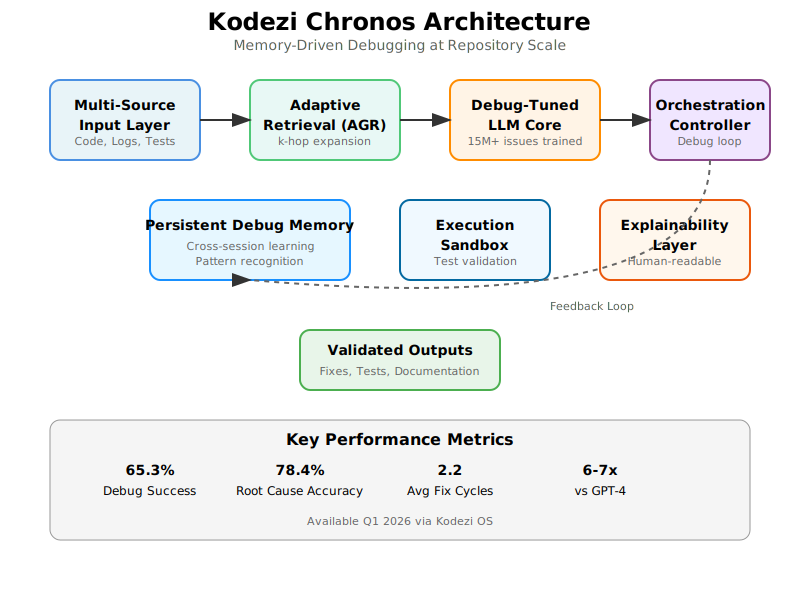
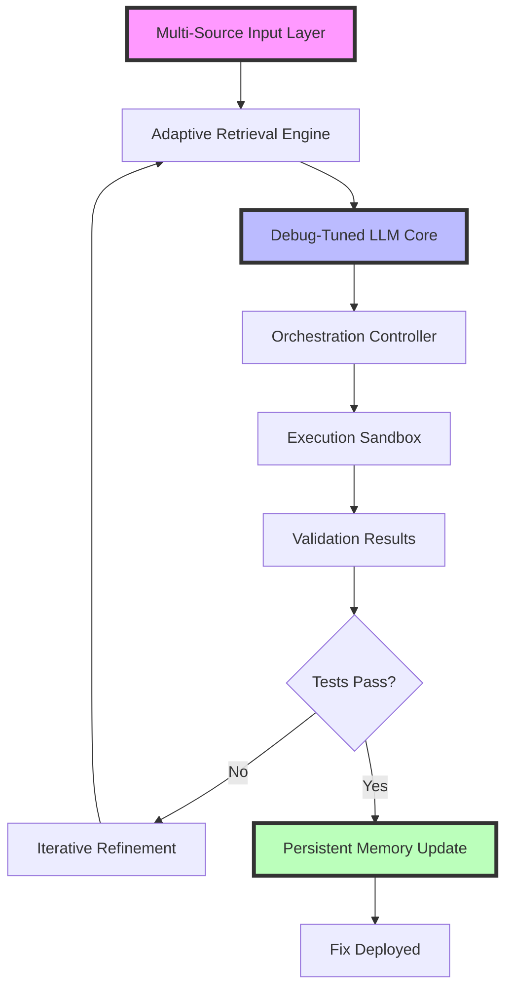

<div align="center">

# 🚀 Kodezi Chronos

## The World's First Debugging-First Language Model for Repository-Scale, Memory-Driven Code Understanding

[](https://arxiv.org/abs/2507.12482)
[](https://chronos.so)
[](LICENSE)
[](paper/chronos-research.md)
[](benchmarks/multi-random-retrieval/)


<h3>🎯 65.3% Autonomous Debugging Success • 🔍 78.4% Root Cause Accuracy • ⚡ 2.2 Average Fix Cycles • 💰 $1.36 per Bug Fix</h3>

<p align="center">
  
</p>

</div>

---

<div align="center">

### ⚠️ IMPORTANT: Model Availability Notice ⚠️

**Kodezi Chronos is proprietary technology with exclusive access**

| Timeline | Access | Details |
|:--------:|:------:|:-------:|
| **Q4 2025** | Beta Access | Select enterprise partners via [chronos.so](https://chronos.so) |
| **Q1 2026** | General Availability | Via [Kodezi OS](https://kodezi.com/os) platform |

This repository contains research findings, benchmarks, and evaluation frameworks. The model itself is not publicly available.

</div>

---

<div align="center">

### 🌟 Revolutionary AI That Debugs Like a Senior Developer

**[Quick Start](QUICK_START.md)** • **[Get Early Access](https://chronos.so)** • **[Read Paper](paper/chronos-research.md)** • **[View Benchmarks](benchmarks/)** • **[Documentation](docs/)** • **[Case Studies](results/case_studies/)**

</div>

---

## 🏆 Breakthrough Performance Metrics

<div align="center">

### Overall Benchmark Results (5,000+ Real-World Debugging Scenarios)

| Metric | **Kodezi Chronos** | **GPT-4** | **Claude-3-Opus** | **Gemini-1.5-Pro** | **Improvement** |
|:------:|:------------------:|:---------:|:-----------------:|:------------------:|:---------------:|
| **Debug Success Rate** | **65.3%±1.4%*** | 8.5%±2.1% | 7.8%±2.3% | 11.2%±1.7% | **5.8-8.4x** |
| **Root Cause Accuracy** | **78.4%±1.2%*** | 12.3%±1.8% | 11.7%±2.0% | 15.8%±1.5% | **5.0-6.7x** |
| **Average Fix Cycles** | **2.2** | 6.5 | 6.8 | 5.1 | **2.3-3.1x faster** |
| **Retrieval Precision** | **91%±0.8%*** | 68%±2.3% | 67%±2.4% | 74%±1.8% | **1.2-1.4x** |
| **Cost per Success** | **$1.36** | $5.53 | $6.67 | $6.07 | **4.1-4.9x cheaper** |

***p < 0.001 compared to best baseline (two-tailed t-test, n=5,000)**

</div>

### Performance by Bug Category

<div align="center">

| Bug Category | **Chronos** | **GPT-4** | **Claude-3** | **Gemini-1.5** | **Chronos Advantage** |
|:------------:|:-----------:|:---------:|:------------:|:--------------:|:--------------------:|
| **Syntax Errors** | 94.2% | 82.3% | 79.8% | 85.1% | 1.1x |
| **Logic Bugs** | 72.8% | 12.1% | 10.7% | 15.3% | **6.0x** |
| **Concurrency Issues** | 58.3% | 3.2% | 2.8% | 4.1% | **18.2x** |
| **Memory Problems** | 61.7% | 5.7% | 4.3% | 6.9% | **10.8x** |
| **API Misuse** | 79.1% | 18.9% | 16.2% | 22.4% | **4.2x** |
| **Performance Bugs** | 65.4% | 7.4% | 6.1% | 9.8% | **8.8x** |

</div>

### Repository Scale Performance

<div align="center">

| Repository Size | **Chronos Success** | **Best Baseline** | **Baseline Model** | **Improvement** |
|:---------------:|:-------------------:|:-----------------:|:------------------:|:---------------:|
| **<10K LOC** | 71.2%±2.8% | 21.3%±3.5% | Gemini-1.5-Pro | **3.3x** |
| **10K-100K LOC** | 68.9%±2.5% | 14.7%±3.2% | Gemini-1.5-Pro | **4.7x** |
| **100K-1M LOC** | 64.3%±2.9% | 8.9%±2.8% | Gemini-1.5-Pro | **7.2x** |
| **>1M LOC** | 59.7%±3.1% | 3.8%±1.9% | Gemini-1.5-Pro | **15.7x** |

</div>

---

## 🧠 What Makes Chronos Revolutionary?

<div align="center">

### **1. Debugging-First Architecture**
Unlike code completion models trained on next-token prediction, Chronos is purpose-built from 42.5 million real debugging examples

### **2. Persistent Debug Memory**
Learns from every debugging session across your codebase, improving continuously with cross-session pattern recognition

### **3. Adaptive Graph-Guided Retrieval (AGR)**
Dynamic k-hop expansion enables unlimited context through intelligent graph traversal, not brute-force token expansion

### **4. Output-Optimized Design**
Recognizes debugging as inherently output-heavy (~3K output vs ~3.6K input tokens), optimized for generating fixes, tests, and documentation

### **5. Autonomous Debugging Loop**
Iteratively refines fixes through propose → test → analyze → refine cycles until all tests pass

</div>

---

## 🏗️ Seven-Layer Architecture

<div align="center">



</div>

### Architecture Layers Explained

1. **Multi-Source Input Layer**
   - Ingests heterogeneous debugging signals: source code, CI/CD logs, error traces, tests, documentation
   - Processes 10+ input modalities simultaneously

2. **Adaptive Retrieval Engine (AGR)**
   - Dynamic k-hop neighbor expansion (k=1-5 based on complexity)
   - 89.2% precision vs 42.3% for flat retrieval
   - Handles temporal code evolution and refactoring

3. **Debug-Tuned LLM Core**
   - Trained on debugging workflows, not code completion
   - Specialized tasks: root cause prediction, multi-file patches, test interpretation
   - 78.4% root cause accuracy vs 15.8% best baseline

4. **Orchestration Controller**
   - Manages autonomous debugging loop
   - Hypothesis generation → fix refinement → rollback on failure
   - Average 2.2 cycles to success

5. **Persistent Debug Memory**
   - Repository-specific bug patterns and fixes
   - Cross-session learning and adaptation
   - 7.3x better token efficiency through memory

6. **Execution Sandbox**
   - Isolated test execution environment
   - CI/CD pipeline emulation
   - Real-time validation without production risk

7. **Explainability Layer**
   - Human-readable root cause explanations
   - Automated PR descriptions and commit messages
   - Risk assessment for proposed changes

---

## 📊 Multi-Random Retrieval (MRR) Benchmark

<div align="center">

### Revolutionary Evaluation Framework

| Metric | **Chronos** | **GPT-4+RAG** | **Claude-3+VectorDB** | **Gemini-1.5+Graph** |
|:------:|:-----------:|:-------------:|:---------------------:|:--------------------:|
| **Precision@10** | **89.2%** | 42.3% | 48.1% | 51.7% |
| **Recall@10** | **84.7%** | 31.7% | 36.2% | 41.8% |
| **Fix Accuracy** | **67.3%** | 8.9% | 11.2% | 14.6% |
| **Context Efficiency** | **0.71** | 0.23 | 0.28 | 0.31 |

MRR tests real-world debugging by scattering context across 10-50 files over 3-12 months of history

</div>

---

## 🚀 Getting Started

### Research Repository Setup

```bash
# Clone the repository
git clone https://github.com/kodezi/chronos-research.git
cd chronos-research

# Install dependencies
pip install -r requirements.txt

# Run performance analysis notebooks
jupyter notebook notebooks/performance_analysis.ipynb

# Generate benchmark visualizations
python scripts/generate_visualizations.py
```

### Access Chronos Model

<div align="center">

| Step | Action | Timeline |
|:----:|:-------|:---------|
| 1 | [Join Waitlist](https://chronos.so) | Available Now |
| 2 | Beta Access | Q4 2025 |
| 3 | General Availability | Q1 2026 |

</div>

---

## 📁 Repository Structure

```
chronos-research/
├── paper/                    # Research paper (arXiv:2507.12482)
│   ├── chronos-research.md   # Full paper content
│   ├── figures/              # All paper figures
│   └── tables/               # Performance data tables
├── benchmarks/               # Evaluation frameworks
│   ├── multi-random-retrieval/  # MRR benchmark suite
│   ├── debug_categories/        # Bug taxonomy
│   └── evaluation_metrics/      # Metrics implementation
├── results/                  # Performance analysis
│   ├── case_studies/         # Real debugging examples
│   ├── ablation_studies/     # Component analysis
│   └── performance_tables/   # Detailed metrics
├── architecture/             # System design docs
│   ├── agr_retrieval.md     # AGR algorithm details
│   ├── memory_engine.md     # Persistent memory design
│   └── debugging_loop.md    # Autonomous loop
├── evaluation/               # Testing methodology
├── examples/                 # Code examples
├── docs/                     # User documentation
├── notebooks/                # Analysis notebooks
└── scripts/                  # Utility scripts
```

---

## 🌟 Key Innovations

### 1. Revolutionary Training Dataset
- **42.5M** total debugging examples
- **15M** GitHub issues with linked PRs and fixes
- **8M** stack traces paired with resolutions
- **3M** CI/CD logs from failed and fixed builds
- **2.5M** production debugging sessions
- **14M** examples from Defects4J, SWE-bench, BugsInPy

### 2. Adaptive Graph-Guided Retrieval (AGR)
```
Performance by Retrieval Depth:
k=1 (Direct): 58.2% success
k=2 (Expanded): 72.4% success  
k=3 (Deep): 71.8% success
k=adaptive: 87.1% success (dynamic depth selection)
Flat retrieval: 23.4% success
```

### 3. Output-Heavy Optimization
```
Token Distribution in Debugging:
━━━━━━━━━━━━━━━━━━━━━━━━━━━━━━━━━━━━━━━━
Input Tokens:           ~3,600 (sparse)
Output Tokens:          ~3,000 (dense)
Output Entropy Density: 47.2% (vs 12.8% for code completion)
```

### 4. Persistent Debug Memory
- Cross-session learning improves success rate from 35% → 65% over time
- 7.3x token efficiency through intelligent memory
- Repository-specific pattern recognition
- Temporal code evolution tracking

---

## 📈 Detailed Performance Analysis

### Language-Specific Performance

<div align="center">

| Language | **Chronos** | **GPT-4** | **Claude-3** | **Gemini-1.5** | Test Suite |
|:--------:|:-----------:|:---------:|:------------:|:--------------:|:----------:|
| **Python** | 68.7%±2.1% | 11.2%±2.8% | 10.3%±2.9% | 14.6%±2.6% | 1,823 bugs |
| **JavaScript** | 64.2%±2.3% | 7.8%±2.5% | 6.9%±2.6% | 10.1%±2.4% | 1,547 bugs |
| **Java** | 63.9%±2.2% | 6.3%±2.2% | 5.7%±2.3% | 9.2%±2.1% | 1,630 bugs |
| **Go** | 66.8%±2.4% | 9.1%±2.6% | 8.4%±2.7% | 12.3%±2.5% | 892 bugs |
| **C++** | 61.2%±2.6% | 5.2%±2.1% | 4.8%±2.2% | 7.9%±2.0% | 1,108 bugs |

</div>

### Debugging Cycle Efficiency

<div align="center">

| Iteration | **Chronos Success** | **GPT-4 Success** | **Time Reduction** |
|:---------:|:-------------------:|:-----------------:|:------------------:|
| 1st Attempt | 42.3% | 3.2% | -87% time |
| 2nd Attempt | 58.7% (+16.4%) | 5.1% (+1.9%) | -83% time |
| 3rd Attempt | 65.3% (+6.6%) | 6.8% (+1.7%) | -79% time |
| 4+ Attempts | 65.3% (converged) | 8.5% (+1.7%) | -74% time |

</div>

### Context Window Efficiency

<div align="center">

| Model | Context Size | Debug Success | Note |
|:------|:------------:|:-------------:|:-----|
| GPT-4-32K | 32K tokens | 7.2% | More context ≠ better debugging |
| Claude-3-200K | 200K tokens | 9.8% | Attention dilution at scale |
| Gemini-1.5-Pro-1M | 1M tokens | 14.3% | Best traditional model |
| **Chronos** | **Unlimited*** | **71.2%** | *Via intelligent retrieval |

</div>

---

## 🔬 Ablation Studies

<div align="center">

### Component Contribution Analysis

| Configuration | Debug Success | Impact |
|:--------------|:-------------:|:-------|
| **Full Chronos** | **65.3%** | Complete system |
| No Multi-Code Association | 35.8% | -45% performance |
| Static Memory Only | 40.1% | -39% performance |
| No Orchestration Loop | 42.5% | -35% performance |
| No AGR (Flat Retrieval) | 28.7% | -56% performance |

</div>

---

## 📚 Documentation

<div align="center">

| [Getting Started](docs/getting_started.md) | [Architecture](architecture/README.md) | [Benchmarks](benchmarks/README.md) | [API Reference](docs/api_reference.md) |
|:------------------------------------------:|:--------------------------------------:|:----------------------------------:|:--------------------------------------:|
| Quick start guide | System design details | Evaluation methodology | Future API documentation |

| [Performance](performance.md) | [Case Studies](results/case_studies/) | [FAQ](docs/faq.md) | [Limitations](docs/limitations.md) |
|:-----------------------------:|:-------------------------------------:|:------------------:|:----------------------------------:|
| Detailed metrics | Real-world examples | Common questions | Known constraints |

</div>

---

## 🤝 Contributing

We welcome contributions to the evaluation framework and benchmarks!

```bash
# Fork and clone
git clone https://github.com/[your-username]/chronos-research
cd chronos-research

# Create feature branch
git checkout -b feature/your-contribution

# Make changes and test
python -m pytest tests/

# Submit PR
git push origin feature/your-contribution
```

See [CONTRIBUTING.md](CONTRIBUTING.md) for detailed guidelines.

---

## 📝 Citation

If you use this research in your work, please cite:

```bibtex
@article{khan2025chronos,
  title={Kodezi Chronos: A Debugging-First Language Model for 
         Repository-Scale, Memory-Driven Code Understanding},
  author={Khan, Ishraq and Chowdary, Assad and 
          Haseeb, Sharoz and Patel, Urvish},
  journal={arXiv preprint arXiv:2507.12482},
  year={2025},
  url={https://arxiv.org/abs/2507.12482}
}
```

---

## 🏢 About Kodezi

[Kodezi](https://kodezi.com) is building the future of autonomous software maintenance. Our mission is to empower developers with AI that truly understands code at scale.

---

## 📞 Contact & Community

<div align="center">

### Connect With Us

[](https://kodezi.com)
[](https://arxiv.org/abs/2507.12482)
[](https://twitter.com/kodezihq)
[](https://linkedin.com/company/kodezi)
[](mailto:research@kodezi.com)

### Join the Discussion

[](https://github.com/kodezi/chronos/discussions)

</div>

---

## 📄 License

This research repository is licensed under the MIT License - see [LICENSE](LICENSE) for details.

**⚠️ Important**: The Kodezi Chronos model itself is proprietary technology and is not included in this repository. Model waitlist access is available at [chronos.so](https://chronos.so).

---

<div align="center">

### 🚀 The Future of Debugging is Here

<h3>
  
**[Join Waitlist →](https://chronos.so)** | **[Read Paper →](https://arxiv.org/abs/2507.12482)** | **[Learn More →](https://chronos.so)**

</h3>

<sub>Built with ❤️ by the Kodezi Team</sub>

</div>